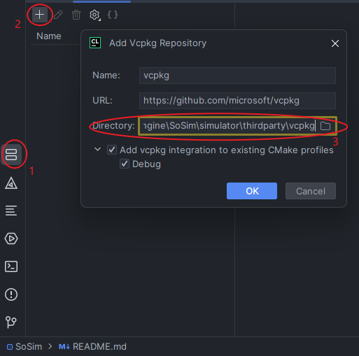
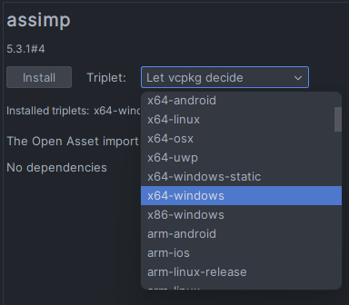

# SoSim

Physical Simulator of SoEngine

## Build with CLion

### Windows

#### 1. setup

```bash
    git clone https://github.com/kevlns/SoSim.git
    git submodule init
    git submodule update
    cd /path/to/thirdparty/vcpkg
    .\bootstrap-vcpkg.bat
```

#### 2. Install dependencies

select vcpkg tool in the project  
  
vcpkg install  
  

#### 3. Build and Run
